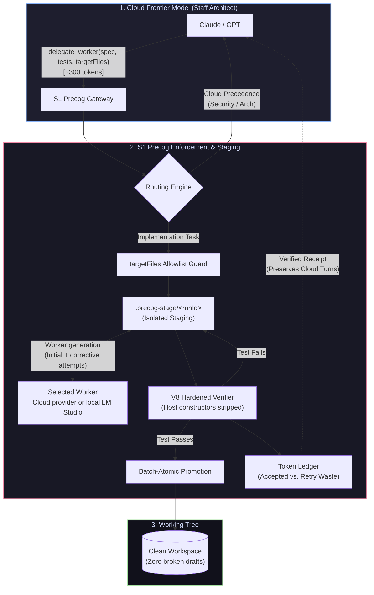

# s1-precog

[](https://www.npmjs.com/package/s1-precog)
[](https://www.npmjs.com/package/s1-precog)
[](https://nodejs.org/)
[](https://modelcontextprotocol.io/)

S1 Precog is an asymmetric AI delegation gateway. An MCP host model handles architecture while a separately configured worker implements bounded file tasks. The worker can be a local LM Studio model or a supported cloud provider; generated files are staged and verified before promotion.

## Overview
> [!WARNING]
> ### Every engineer knows the feeling:
> You’re in the zone at 2:00 PM, you ask the model to implement a schema or write 15 unit tests, and at 2:15 PM you get hit with:
>
> ## *"You've reached your usage limit until 7:00 PM."*
>
S1 Precog is a Model Context Protocol (MCP) server exposing a `delegate_worker` tool. A System 1 routing layer classifies work, sends implementation tasks to the selected worker, extracts emitted files, verifies generated tests in-process, and promotes validated output into the workspace.

The server is designed for developer workspaces. Staging, verification, and token accounting run locally, and a compact receipt returns to the MCP client. Delegated task content is sent to the selected worker endpoint.

## Keep architecture in the host model and delegate bounded implementation

Many coding tools ask you to choose one model for an entire task. S1 Precog lets the host model keep architectural context while another worker handles declared file output.

**S1 Precog is not a model switcher. It is an in-flight delegation pipeline.**

### 1. Hierarchical delegation instead of a flat toggle

In typical tools such as Cursor, Continue, and Aider, you pick one model for the task.

- A cloud frontier model burns expensive context and rate limits writing repetitive TypeScript boilerplate and test assertions.
- A worker can focus on a precise interface and test contract while the host retains cross-file design decisions.

S1 Precog assigns different jobs to different systems. The host model acts as the **Staff Architect** and a selected worker handles bounded implementation tasks. The host retains high-level orchestration, then calls `delegate_worker` when implementation, schemas, or tests need to be generated. With no provider configured, the worker defaults to LM Studio at `127.0.0.1:1234`.

### Token count doesn't decide it; cognitive depth does.

The Cloud Model is the Architect: Claude designs the interfaces and data contracts in the chat.

MCP is the Dispatch: When it's time to write the 500 lines of tests or boilerplate that satisfy that interface, Claude calls delegate_worker.

The Gateway is the Guard: S1 Precog limits output to declared files, runs generated assertions in staging, and returns a verification receipt.

You keep the host model focused on design while the configured worker writes and verifies bounded changes.

### 2. Silent local verification and self-correction

When a worker produces a syntax error or broken import, sending the failure back to the host model can consume another turn and more context.

S1 Precog keeps verification and retry coordination inside the gateway:

- Generated code runs through the hardened in-process verifier.
- Failed tests trigger a corrective worker attempt.
- The cloud model receives the final verified code or a structured failure receipt.

Corrective attempts are reported as retry overhead in the receipt and ledger.

### 3. Batch-atomic workspace protection

Many local coding agents write directly to the working tree. A failed generation can leave half-written files, unformatted code, or broken imports.

S1 Precog writes to .precog-stage/<runId>, runs verification there, and promotes files only after the run succeeds. Failed runs are rolled back, keeping draft output out of the working tree.

### 4. Mandatory allowlisting instead of rogue writes

Prompt instructions such as “only edit these files” are not a filesystem security control. If a worker drifts, it may emit unrelated files or leave artifacts in the project root.

S1 Precog enforces a programmatic invariant: if a file is not in targetFiles, emission is rejected before promotion.

### 5. Honest telemetry instead of inflated vanity metrics

A worker may fail several times before producing an accepted result. Counting every generated token as “saved” overstates the benefit.

S1 Precog separates **accepted shielded tokens**—the output actually committed to disk—from **retry overhead**, the worker effort spent correcting failed attempts. The ledger reports accepted output and retry usage separately.

### The concrete difference

| Workflow | Cloud API cost and turns | Workspace state on failure | Reasoning quality |
| --- | --- | --- | --- |
| **Pure Cloud (Claude/GPT)** | Burns 10k–30k tokens on boilerplate and test mocks | Clean, but cloud quota is consumed quickly | Frontier |
| **Pure Local (Ollama/LM Studio)** | Free cloud usage | May leave broken code in the working tree | Prone to architectural drift |
| **S1 Precog (Asymmetric)** | Keeps implementation output out of the host model's context; worker cost depends on provider | Drafts remain in `.precog-stage/` until verification passes | **Host architecture plus bounded worker generation** |

## S1 Precog delegation flow


## Core capabilities

- **Heuristic and ML routing:** A fast heuristic engine handles common decisions, while configurable HTTP sidecars and ONNX providers can route implementation to the worker or architectural decisions back to the host.
- **Hardened in-process verification:** Generated assertion scripts run in a bounded V8 context with host constructors stripped, dynamic string and WebAssembly code generation disabled, timer handles tracked, and asynchronous failures reported.
- **Batch-atomic workspace staging:** Generated files are written under `.precog-stage/`, verified there, and promoted with per-file atomic replacement and rollback on promotion failure.
- **Honest quota accounting:** Accepted shielded tokens and local retry waste are tracked separately. Savings are calculated from accepted output only, while retry attempts remain visible as local compute overhead.
- **Strict file ingress:** Delegations declare a non-empty `targetFiles` allowlist. Paths are normalized across Windows and POSIX separators, and emitted files are rejected when they are undeclared or escape the workspace.
- **Provider waterfall:** Process overrides, saved user configuration, detected provider keys, then a local LM Studio fallback select the worker without requiring credentials in MCP host settings.

## Quickstart

Add this entry to your MCP host configuration, such as Claude Desktop's `claude_desktop_config.json` or Cursor's `.cursor/mcp.json`:

```json
{
  "mcpServers": {
    "s1-precog": {
      "command": "npx",
      "args": ["-y", "s1-precog", "serve"]
    }
  }
}
```

**No API keys or environment variables are needed in the MCP client settings.** S1 Precog resolves its worker provider internally from process overrides, a saved user configuration, detected provider keys, or local LM Studio. Cloud providers still require a key through your normal environment or `s1-precog config`; the local fallback requires no credential.

In your workspace, run initialization once to create project rules:

```powershell
npx -y s1-precog init
```

For a global installation, run `npm install -g s1-precog` and use `s1-precog` in place of `npx -y s1-precog`.

## Worker provider resolution

S1 Precog selects the worker through this four-tier waterfall, using the first available tier:

1. **Explicit process overrides:** `WORKER_BASE_URL`, `WORKER_MODEL`, or `WORKER_API_KEY` select a worker directly. These belong in the process environment when needed; the MCP client configuration above needs no `env` block.
2. **Persistent user configuration:** `~/.precog/config.json`, managed with `s1-precog config`, supplies the provider, model, endpoint, and key or key source.
3. **Auto-detected provider keys:** If no override or saved provider exists, S1 Precog checks these environment variables in order:

   | Variable | Provider | Default model |
   | --- | --- | --- |
   | `DEEPSEEK_API_KEY` | DeepSeek Cloud | `deepseek-flash` |
   | `OPENAI_API_KEY` | OpenAI | `gpt-4o` |
   | `OPENROUTER_API_KEY` | OpenRouter Gateway | `deepseek/deepseek-chat` |
   | `GROQ_API_KEY` | Groq | `qwen-2.5-coder-32b` |

4. **Local hardware fallback:** With no configuration or detected key, use LM Studio at `http://127.0.0.1:1234/v1` with `qwen/qwen3.8-27b`. This local path needs no API key and has no provider API charge. For an Ollama OpenAI-compatible endpoint, set `WORKER_BASE_URL` and `WORKER_MODEL` to its actual address and model.

The current OpenAI preset is `gpt-4o`; to use `gpt-4o-mini`, set `WORKER_MODEL=gpt-4o-mini` or choose it in `s1-precog config`.

### Configuration wizard

`s1-precog config` opens an interactive terminal wizard to select an auto-detected provider, local LM Studio, or a custom OpenAI-compatible endpoint and manage its key. The saved file is `~/.precog/config.json`.

| Command | Effect |
| --- | --- |
| `s1-precog config --show` | Show the resolved provider, model, endpoint, masked API key, and resolution source. |
| `s1-precog config --mode local` | Save local LM Studio mode immediately. |
| `s1-precog config --reset` | Clear the saved configuration and return to environment auto-detection, then local fallback. |

Other optional settings include `S1_PRECOG_HOME` for the telemetry base directory, `BENCHMARK_MODEL` for avoided-cost estimates, and `VERIFIER_BACKEND` (`vm` by default or `docker`). Pricing tiers live in `.codex/pricing.json`.

## CLI reference

| Command | Description |
| --- | --- |
| `s1-precog serve` | Start the stdio MCP server for Codex, Claude Desktop, or Cursor. This is the default command. |
| `s1-precog config` | Open the interactive provider and key configuration wizard. |
| `s1-precog config --show` | Print the active provider, model, endpoint, masked key, and resolution source. |
| `s1-precog config --reset` | Clear `~/.precog/config.json` and return to environment auto-detection. |
| `s1-precog config --mode local` | Select local LM Studio at `127.0.0.1:1234`. |
| `s1-precog init` | Scaffold project-aware `.precog/worker.md` and `AGENTS.md` rules. |
| `s1-precog stats` | Show cumulative shielded tokens, saved cloud turns, retry overhead, and estimated avoided cost. |
| `s1-precog test-worker <task>` | Run a delegation directly, verifying in staging before optional promotion. |

### Workspace initialization and project tuning

Run `s1-precog init` in any repository. It inspects `package.json`, `tsconfig.json`, and Next.js dependencies to choose ESM or CommonJS syntax and TypeScript or JavaScript. A bare directory defaults to ESM JavaScript. The generated `.precog/worker.md` asks the worker to use Node built-ins, avoid new external staging dependencies, write self-contained `node:assert/strict` tests, and use `tsx` for direct TypeScript execution only if the project already provides it.

The generated `AGENTS.md` tells the host model when to delegate, when to edit directly, and to report the verification receipt verbatim. `init` preserves custom files rather than overwriting them. On each delegation, S1 Precog reads project rules from `<workspace>/.precog/worker.md` and user rules from `~/.precog/worker.md`, in that order, into the worker system prompt.

### Direct worker test

Name each expected output file in the task or pass repeatable `--target` flags. `test-worker` defaults to `--dry-run`: it verifies generated assertions in staging, prints a diff and receipt, then cleans up without promotion. `--apply` promotes files only after verification passes. `--verbose` prints the full prompt payload and raw generated blocks.

```powershell
s1-precog test-worker 'Create src/ping.js and src/ping.test.js with node:assert coverage' --dry-run
s1-precog test-worker 'Create a ping module and assertion test' --target src/ping.js --target src/ping.test.js --apply
```

## Verification receipts and telemetry

Each delegation receipt reports inference, staging verification, promotion, and total execution time at millisecond resolution. For example:

```text
Status: SUCCESS
Worker: WORKER_CLOUD (deepseek-flash)
Timings:
  • Inference / Thinking: 2248 ms
  • Staging Test:         40 ms
  • Promotion I/O:        4 ms
  • Total Worker Time:    2.31 s
Staging Verification: PASSED (slugify tests passed)
Retry Waste: 0 tokens
```

The JSON receipt also includes files written, verification results, token usage, and operational metrics. Run `s1-precog stats` to see cumulative accepted prompt and completion tokens shielded from cloud context, local retry overhead, estimated source bytes and cloud turns avoided, and estimated USD saved. The ledger lives at `~/.s1-precog/ledger.json`; an existing `~/.codex-s1` ledger is copied on first use without replacing newer data. Staged files live under `.precog-stage/` and are cleaned after each run.

## Worker contract

The `delegate_worker` tool accepts:

- `task`: Detailed implementation contract and acceptance criteria.
- `targetFiles`: Required non-empty list of workspace-relative output paths.
- `runVerification`: Whether generated assertion scripts should run in-process.
- `testSpec`: Additional verification requirements.
- `workspacePath`: Optional absolute workspace root.

The selected worker emits files using explicit `<<<FILE: path>>>` and `<<<END_FILE>>>` delimiters or supported Markdown code fences. A compact JSON receipt reports routing, written files, verification, token usage, retry overhead, and operational metrics.

## Security and isolation model

S1 Precog uses an in-process V8 `vm` context with host constructors such as `Buffer`, `process`, and `URL` stripped from the verifier context. Dynamic string and WebAssembly code generation is disabled, timer handles are tracked and cleared, and unhandled promise or timer failures fail verification.

- **Primary goal:** Sub-second contract verification, type regression detection, and safe atomic promotion without triggering OS process-spawning restrictions such as `spawn EPERM`.
- **Isolation scope:** Designed for developer workflows where the operator controls the prompts, worker endpoint, and workspace.
- **Threat model:** The verifier is a runtime contract checker and regression guard, not a cryptographic jail for hostile third-party code.
- **Stronger isolation:** Untrusted third-party prompts or code should run in a dedicated process, container, or other OS-level sandbox with restricted filesystem and network permissions.

The staging directory is cleaned after each delegation. The savings ledger records accepted output separately from failed or corrective worker attempts so operational reports remain auditable.

## Docker

`docker-compose.yml` has separate profiles for the MCP server, isolated verifier, and optional local inference services. The server image in `docker/Dockerfile.server` copies all of `src/` (including `config.ts` and worker guidelines), then runs `npm ci` and `npm run build`. The verifier image intentionally copies no application files or credentials; it receives only staged files at runtime.

The server service bind-mounts the current workspace, persistent user configuration at `/root/.precog`, and the telemetry ledger at `/root/.s1-precog`. By default those persistent host directories are `.precog-docker/` and `.s1-precog-docker/` beside the Compose file. To reuse your normal user configuration on PowerShell:

```powershell
$env:PRECOG_CONFIG_DIR = Join-Path $HOME '.precog'
$env:PRECOG_LEDGER_DIR = Join-Path $HOME '.s1-precog'
docker compose --profile server build server
docker compose run --rm -T server serve
```

On Unix shells, set `PRECOG_CONFIG_DIR="$HOME/.precog"` and `PRECOG_LEDGER_DIR="$HOME/.s1-precog"` before the Compose commands. The equivalent direct mount is `-v ~/.precog:/root/.precog`. Compose passes through optional `DEEPSEEK_API_KEY`, `OPENAI_API_KEY`, `OPENROUTER_API_KEY`, `GROQ_API_KEY`, and explicit `WORKER_*` overrides. For LM Studio on the Docker host, set `WORKER_BASE_URL=http://host.docker.internal:1234/v1` and `WORKER_MODEL` to the loaded model; `127.0.0.1` inside the server container refers to the container itself.

## Development

```powershell
npm install
npm run build
npm test
```

The build emits compiled runtime files under `dist/`. Runtime artifacts, staging data, local ledgers, logs, and npm pack tarballs are excluded by `.gitignore`.

## License

This project is licensed under the [MIT License](LICENSE).

> **Note on Model Weights:** The orchestration engine, MCP server, and tooling code are licensed under MIT. If you use pre-trained ONNX models or custom local weights with `LayaOnnxEngine`, those weights remain subject to their respective creators' licensing terms.


