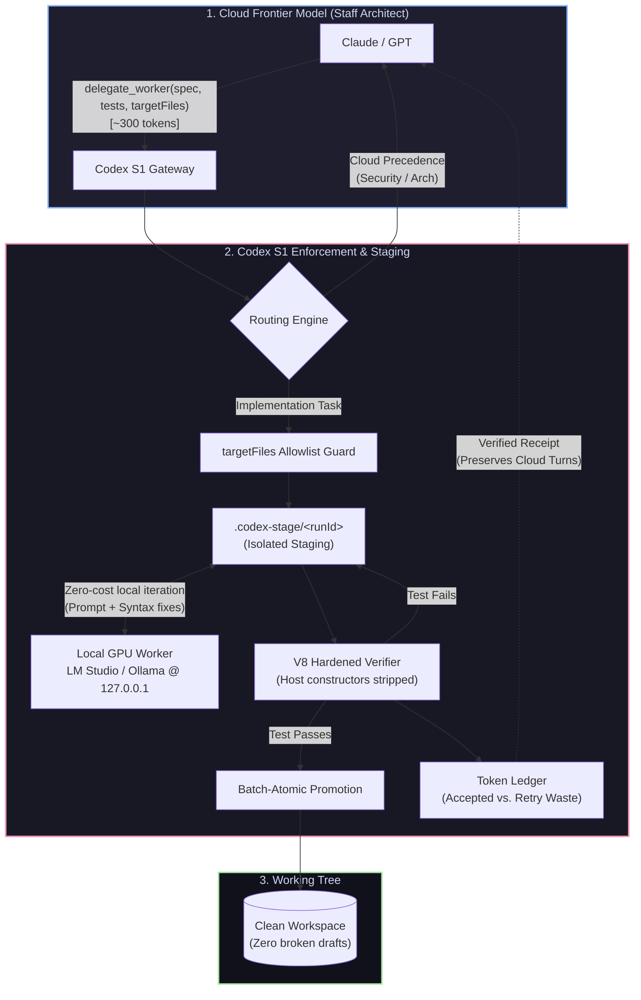

# codex-s1

[](https://www.npmjs.com/package/codex-s1)
[](https://www.npmjs.com/package/codex-s1)
[](https://nodejs.org/)
[](https://github.com/jjmlovesgit/codex-s1)
[](https://modelcontextprotocol.io/)

Codex S1 is an asymmetric AI delegation gateway. It connects cloud frontier reasoning models from OpenAI and Anthropic and others with local GPU workers. Cloud models handle architectural tasks while local models handle implementation and verification close to the developer's workspace.

## Overview
> [!WARNING]
> ### Every engineer knows the feeling:
> You’re in the zone at 2:00 PM, you ask the model to implement a schema or write 15 unit tests, and at 2:15 PM you get hit with:
> 
> ## *"You've reached your usage limit until 7:00 PM."*
> 
Codex S1 is a local Model Context Protocol (MCP) server exposing a `delegate_worker` tool. A System 1 routing layer classifies work, sends implementation tasks to a local model, extracts emitted files, verifies generated tests in-process, and promotes validated output into the workspace.

The server is designed for local developer workflows. It keeps source files and token accounting on the local machine while providing a compact receipt to the calling MCP client.

## Pay cloud tokens for thinking, and use local silicon for typing

What “everyone does” is toggle a dropdown: you either run 100% on Claude/GPT, or you switch to Ollama and lose frontier-grade reasoning.

**Codex S1 is not a model switcher. It is an in-flight delegation pipeline.**

### 1. Hierarchical delegation instead of a flat toggle

In typical tools such as Cursor, Continue, and Aider, you pick one model for the task.

- A cloud frontier model burns expensive context and rate limits writing repetitive TypeScript boilerplate and test assertions.
- A local model is inexpensive, but may struggle with complex cross-file architecture or long-horizon planning.

Codex S1 assigns different jobs to different systems. The cloud model acts as the **Staff Architect** and the local GPU acts as the **Junior Implementation Worker**. The cloud model retains high-level orchestration, then calls delegate_worker when implementation, schemas, or tests need to be generated. The heavy token lifting happens on the local GPU behind 127.0.0.1, preserving cloud context for architectural reasoning.

### Token count doesn't decide it; cognitive depth does.

The Cloud Model is the Architect: Claude designs the interfaces and data contracts in the chat.

MCP is the Dispatch: When it's time to write the 500 lines of tests or boilerplate that satisfy that interface, Claude calls delegate_worker.

The Gateway is the Guard: codex-s1 isolates the job to declared files, runs the typing and tests on your local GPU, verifies it in an atomic sandbox, and reports back a 1-line receipt.

You keep Claude as your Staff Engineer for thinking, you offload the keyboard typing to your local GPU, and you stay in your editor without getting kicked off the API.

### 2. Silent local verification and self-correction

When a standard local model produces a syntax error or broken import, the failure is often sent back to the cloud model, consuming another API turn and thousands of tokens.

Codex S1 keeps this loop local:

- Generated code runs through the hardened in-process verifier.
- Failed tests trigger a local corrective attempt.
- The cloud model receives the final verified code or a structured failure receipt.

Cloud message turns and rate limits are insulated from local trial-and-error work.

### 3. Batch-atomic workspace protection

Many local coding agents write directly to the working tree. A failed generation can leave half-written files, unformatted code, or broken imports.

Codex S1 writes to .codex-stage/<runId>, runs verification there, and promotes files only after the run succeeds. Failed runs are rolled back, keeping draft output out of the working tree.

### 4. Mandatory allowlisting instead of rogue writes

Prompt instructions such as “only edit these files” are not a filesystem security control. If a local model drifts, it may overwrite unrelated files or leave artifacts in the project root.

Codex S1 enforces a programmatic invariant: if a file is not in targetFiles, emission is rejected before promotion.

### 5. Honest telemetry instead of inflated vanity metrics

A local model may fail several times before producing an accepted result. Counting every generated token as “saved” overstates the benefit.

Codex S1 separates **accepted shielded tokens**—the output actually committed to disk—from **local retry overhead**, the GPU work spent correcting failed attempts. The ledger reports what was kept off cloud billing and what was consumed by local recovery.

### The concrete difference

| Workflow | Cloud API cost and turns | Workspace state on failure | Reasoning quality |
| --- | --- | --- | --- |
| **Pure Cloud (Claude/GPT)** | Burns 10k–30k tokens on boilerplate and test mocks | Clean, but cloud quota is consumed quickly | Frontier |
| **Pure Local (Ollama/LM Studio)** | Free cloud usage | May leave broken code in the working tree | Prone to architectural drift |
| **Codex S1 (Asymmetric)** | Preserves most cloud context; cloud spends roughly 300 tokens delegating | Drafts remain in .codex-stage until verification passes | **Frontier architecture plus free local generation** |

You did not build a wrapper around an inference server. You built an enforcement gateway that lets frontier models safely outsource repetitive implementation work to local silicon.

## Codex S1 delegation flow


## Core capabilities

- **Heuristic and ML routing:** A fast heuristic engine handles common decisions, while configurable HTTP sidecars and ONNX providers can route between a local worker and a cloud architect.
- **Hardened in-process verification:** Generated assertion scripts run in a bounded V8 context with host constructors stripped, dynamic string and WebAssembly code generation disabled, timer handles tracked, and asynchronous failures reported.
- **Batch-atomic workspace staging:** Generated files are written under `.codex-stage/`, verified there, and promoted with per-file atomic replacement and rollback on promotion failure.
- **Honest quota accounting:** Accepted shielded tokens and local retry waste are tracked separately. Savings are calculated from accepted output only, while retry attempts remain visible as local compute overhead.
- **Strict file ingress:** Delegations declare a non-empty `targetFiles` allowlist. Paths are normalized across Windows and POSIX separators, and emitted files are rejected when they are undeclared or escape the workspace.
- **Local-first operation:** LM Studio is the default HTTP worker endpoint, with configuration suitable for other local runtimes such as Ollama-compatible gateways.

## Quickstart

### Zero-install execution

View the local savings ledger without installing globally:

```powershell
npx -y codex-s1 stats
```

Start the stdio MCP server:

```powershell
npx -y codex-s1
```

The default command is equivalent to:

```powershell
npx -y codex-s1 serve
```

### Global installation

```powershell
npm install -g codex-s1
codex-s1 stats
codex-s1 serve
```

### Add as a development dependency

```powershell
npm install --save-dev codex-s1
```

Example `package.json` scripts:

```json
{
  "scripts": {
    "mcp:serve": "codex-s1 serve",
    "mcp:stats": "codex-s1 stats"
  }
}
```

## MCP client configuration

Codex S1 communicates over standard input/output. Configure the client to launch `codex-s1 serve`.

### Claude Desktop

Add a server entry to `claude_desktop_config.json`:

```json
{
  "mcpServers": {
    "codex-s1": {
      "command": "codex-s1",
      "args": ["serve"],
      "env": {
        "LM_STUDIO_URL": "http://127.0.0.1:1234/v1",
        "LOCAL_MODEL_NAME": "qwen2.5-coder-32b-instruct"
      }
    }
  }
}
```

If the package is not installed globally, use an absolute command path or invoke it through `npx`:

```json
{
  "mcpServers": {
    "codex-s1": {
      "command": "npx",
      "args": ["-y", "codex-s1", "serve"]
    }
  }
}
```

### Cursor

Create or update `.cursor/mcp.json` in the workspace:

```json
{
  "mcpServers": {
    "codex-s1": {
      "command": "codex-s1",
      "args": ["serve"],
      "env": {
        "LM_STUDIO_URL": "http://127.0.0.1:1234/v1",
        "LOCAL_MODEL_NAME": "qwen2.5-coder-32b-instruct"
      }
    }
  }
}
```

## Environment variables

| Variable | Example | Purpose |
| --- | --- | --- |
| `LM_STUDIO_URL` | `http://127.0.0.1:1234/v1` | Base URL for the local OpenAI-compatible worker endpoint. |
| `LOCAL_MODEL_NAME` | `qwen2.5-coder-32b-instruct` | Local model identifier sent to the worker endpoint. |
| `STAGE_DIR` | `.codex-stage` | Workspace staging directory used for generated files before promotion. |
| `BENCHMARK_MODEL` | `gpt-5.6-luna` | Benchmark tier used when presenting avoided cloud cost. |

Pricing tiers are stored in `.codex/pricing.json`. The active benchmark can be changed there without recompiling the server.

## CLI reference

### `codex-s1 serve`

Starts the stdio MCP server. This is the default command.

### `codex-s1 stats`

Reads `savings-ledger.json` and prints cumulative delegation and savings metrics:

```text
Codex S1 statistics

Total delegations                    12
Total sessions                       12
Accepted completion tokens shielded  18,420
Accepted prompt tokens shielded       31,600
Local retry completion overhead       1,204
Local retry prompt overhead           2,180
Source code bytes avoided             42.18 KB
Cloud message turns saved             12.28
Active benchmark model                gpt-5.6-luna
Estimated avoided USD                 $0.148320
```

## Worker contract

The `delegate_worker` tool accepts:

- `task`: Detailed implementation contract and acceptance criteria.
- `targetFiles`: Required non-empty list of workspace-relative output paths.
- `runVerification`: Whether generated assertion scripts should run in-process.
- `testSpec`: Additional verification requirements.
- `workspacePath`: Optional absolute workspace root.

The local worker emits files using explicit `<<<FILE: path>>>` and `<<<END_FILE>>>` delimiters or supported Markdown code fences. A compact JSON receipt reports routing, written files, verification, token usage, retry overhead, and operational metrics.

## Security and isolation model

Codex S1 uses an in-process V8 `vm` context with host constructors such as `Buffer`, `process`, and `URL` stripped from the verifier context. Dynamic string and WebAssembly code generation is disabled, timer handles are tracked and cleared, and unhandled promise or timer failures fail verification.

- **Primary goal:** Sub-second contract verification, type regression detection, and safe atomic promotion without triggering OS process-spawning restrictions such as `spawn EPERM`.
- **Isolation scope:** Designed for local developer workflows where the operator controls the prompts, local model, and workspace.
- **Threat model:** The verifier is a runtime contract checker and regression guard, not a cryptographic jail for hostile third-party code.
- **Stronger isolation:** Untrusted third-party prompts or code should run in a dedicated process, container, or other OS-level sandbox with restricted filesystem and network permissions.

The staging directory is cleaned after each delegation. The savings ledger records accepted output separately from failed or corrective worker attempts so operational reports remain auditable.

## Development

```powershell
npm install
npm run build
npm test
```

The build emits compiled runtime files under `dist/`. Runtime artifacts, staging data, local ledgers, logs, and npm pack tarballs are excluded by `.gitignore`.

## License

See `LICENSE` when distributed with the package.


